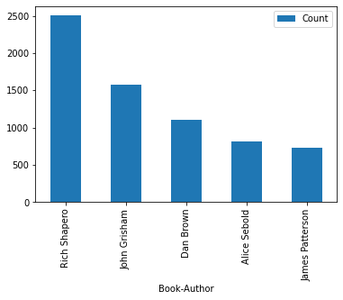
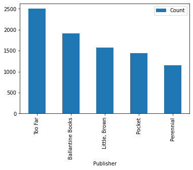
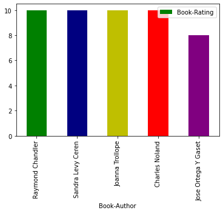
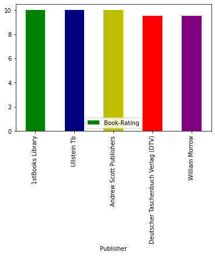

# Laporan Proyek Sistem Rekomendasi - I Gusti Ngurah Bagus Ferry Mahayudha

# Ulasan Proyek

## Latar belakang
Buku telah menjadi sumber pengetahuan, hiburan, dan inspirasi bagi manusia sepanjang sejarah. Dengan berbagai genre dan topik, buku menawarkan beragam informasi dan pengalaman kepada pembacanya. Dalam era di mana jumlah buku yang tersedia sangat banyak, pembaca sering kali menghadapi kesulitan dalam memilih buku yang sesuai dengan minat, preferensi, atau kebutuhan mereka. Tantangan ini memicu perkembangan sistem rekomendasi buku.

Sistem rekomendasi buku menggunakan teknik-teknik machine learning dapat digunakn untuk menganalisis rating atau perilaku pembaca guna memberikan rekomendasi yang sesuai dengan preferensi setiap individu. Model rekomendasi buku menggunakan berbagai teknik machine learning, termasuk collaborative filtering dan content-based filtering. Collaborative filtering memanfaatkan informasi dari perilaku sejumlah besar pengguna untuk memberikan rekomendasi, sedangkan content-based filtering memanfaatkan informasi atribut buku itu sendiri. Dengan adanya aplikasi rekomendasi diharapkan dapat mempermudah dalam pencarian dan pemilihan buku yang ada[1].

## Mengapa dan bagaimana menyelesaikan masalah tsb
Karena pembaca sering kali menghadapi kesulitan dalam memilih buku yang sesuai dengan minat, preferensi, atau kebutuhan mereka. Sehingga, diperlukan adanya model rekomendasi buku menggunakan berbagai teknik machine learning, termasuk collaborative filtering dan content-based filtering.

## Artikel terkait
1. [APLIKASI REKOMENDASI DALAM PEMILIHAN BUKU SISWA DI PERPUSTAKAAN MENGGUNAKAN METODE COLLABORATIVE FILTERING PADA SMKN 2 MANDAU BERBASIS WEB](https://journal.unilak.ac.id/index.php/zn/article/view/9531)
- Author : D. Siswanto, Z. Zamzami, L. Nijal, S. Rajab, dan S. Ridar Wilis Rambe
- Tahun : 2022

# Business Understanding
## Rumusan masalah
1. Bagaimana cara untuk menghadapi kesulitan dalam memilih buku yang sesuai dengan minat dan preferensi mereka di antara ribuan judul yang tersedia di pasaran?
2. Apakah sistem rekomendasi dapat menghemat waktu dalam melakukan pencarian buku yang sesuai dengan preferensi?
3. Apakah sistem rekomendasi dapat menyesuaikan preferensi pembaca yang mungkin bisa berubah sepanjang waktu?
4. Apakah hanya perlu satu metrik untuk mengukur performa model secara akurat?

## Tujuan proyek
1. Untuk membuat sistem rekomendasi yang dapat memberikan rekomendasi dengan 2 pendekatan, yaitu _content-based filtering_ dan _colaborative filtering_.
2. Untuk mengetahui cara mengukur performa model rekomendasi dengan _colaborative filtering_.
3. Untuk mengetahui penggunaan model rekomendasi yang sudah jadi.
4. Untuk mengetahui cara untuk melakukan pra-pemrosesan data sebelum digunakan untuk membuat model.

## Solusi permasalahan
1. Membuat 2 model rekomendasi dengan pendekatan _content-based filtering_ dan _colaborative filtering_.
2. Membuat kode untuk implementasi model rekomendasi

# Data Understanding
## Sumber data
[Book Recommendation Dataset](https://www.kaggle.com/datasets/arashnic/book-recommendation-dataset)

## Detail data
Terdapat 25001 entries untuk data yang sudah dibersihkan.
Total kolom pada data berjumlah 7 kolom dengan detail sebagai berikut :

Tabel 1. Detail Data

| Column                 | Non-Null Count  | Dtype     |
| :---                   |    :------:     |      ---: |
| ISBN                   | 25001 non-null  | object    |
| Book-Title             | 25001 non-null  | object    |
| Book-Author            | 25001 non-null  | object    |
| Year-Of-Publication    | 25001 non-null  | object    |
| Publisher              | 25001 non-null  | object    |
| User-ID                | 25001 non-null  | int64     |
| Book-Rating            | 25001 non-null  | int64     |

Pada Tabel 1, data fitur dan data target untuk _content-based recommendation_ bertipe data object(string) dan tipe data untuk data target adalah object(string). Data fitur untuk _colaborative recommendation_ bertipe data object(string) dan data target yang digunakan bertipe data int64 dengan tipe data objek 5 kolom, int64 2 kolom, penggunaan memori 1.5+ MB.

## Fitur dan target yang akan digunakan
Variabel Fitur untuk _Content-Based_ : `Book-Author`\
Variabel Target untuk _Content-Based_ : `Book-Title`

Variabel Fitur untuk _Content-Based_ : `User-ID`, `ISBN`\
Variabel Target untuk _Content-Based_ : `Book-Rating`

## Exploratory Data Analysis
Tahapan dalam EDA yang dilakukan adalah :

1. Univariative Data Analysis

    Dalam tahap ini, sebaran data untuk masing-masing stasiun dan kategori divisualisasikan dengan **plot.bar()** dengan pengambilan data yaitu **df['nama_kolom'].value_counts()**. Data yang diambil merupakan top 5 dari data yang diperoleh dengan **head()** atau **head(5)**

    Berikut merupakan visulasisasi dari analisis eda yang dilakukan :

    Gambar 1. Top 5 Penulis buku terbanyak
    
    Pada gambar 1, urutan 5 teratas penulis dengan buku terbanyak ditampilkan

    Gambar 2. Top 5 Pnerbit buku terbanyak
    
    Pada gambar 2, urutan 5 teratas penerbit dengan buku terbanyak ditampilkan

2. Multivariative Data Analysis

    Dalam tahap ini, rata-rata data numerik diambil menggunakan fungsi **groupby()** dan disambung dengan **agg()** dengan argumen dictionary **{'nama_kolom':'mean'}**. Lalu, rata-rata data numerik untuk masing-masing stasiun dan kategori divisualisasikan langsung dari dataframe dengan **df.plot.bar()** dengan **x='nama_kolom'** dan **y='nama_kolom_numerik'** dan untuk pewarnaan yang berbeda yaitu 5 warna untuk penulis buku dan penerbit berdasarkan top 5 dari data yang diperoleh dengan **head()** atau **head(5)**

    Berikut merupakan visualisasi dari analisis eda yang dilakukan :

    Gambar 3. Top 5 Penulis dengan rata-rata rating tertinggi
    
    Pada gambar 3, urutan 5 teratas penulis dengan rata-rata rating tertinggi ditampilkan

    Gambar 4. Top 5 Penerbit dengan rata-rata rating tertinggi
    
    Pada gambar 4, urutan 5 teratas penerbit dengan rata-rata rating tertinggi ditampilkan

# Data Preparation
## Content-Based Recommendation
Teknik-teknik yang digunakan adalah sebagai berikut:
1. Membuat vectorizer tf-idf dan matriks tf-idf\
   Teknik vektorisasi tf-idf adalah teknik yang berdasarkan pendekatan _Basic-Vectorization_. Sebelum membuat matriks tf-idf, objek **TfidfVectorizer** harus dipanggil terlebih dahulu dalam variabel class **vector**. Untuk membuat matriks tf-idf, digunakan **vector.fit_transform(df['nama_kolom'])**.

## Colaborative Recommendation
Teknik-teknik yang digunakan adalah sebagai berikut:
1. Membuat encoder dan decoder untuk fitur 'User-ID' dan 'Book-Rating'
   Untuk mengambil nilai unik dari data fitur dalam bentuk list, digunakan **df['nama_kolom_fitur'].unique().tolist()**. Lalu, untuk membuat encoder dalam bentuk dictionary, digunakan **{x: i for i, x in enumerate(data)}**, sedangkan untuk decoder, digunakan **{i: x for i, x in enumerate(data)}**.

2. Menormalisasi variabel target 'Book-Rating'
   Normalisasi yang digunakan adalah min-max scaling dengan mencari nilai minimum suatu data target dengan **min(df['nama_kolom_target'])** dalam bentuk variabel **min_rating** dan nilai maksimum dengan **max(df['nama_kolom_target'])** dalam bentuk variabel **max_rating**, Lalu, untuk normalisasi digunakan fungsi lambda seperti **df['nama_kolom_target'].apply(lambda x: x - min_rating / (max_rating - min_rating))**.

3. Mengacak dataframe sebanyak 42 kali
   Method yang digunakan adalah **df.sample()** dengan parameter **frac=1** dan **random_state=42**.

4. Memisahkan data menjadi data uji dan data latih
   Pemisahan data menjadi data latih dan data uji dilakukan dengan rasio antara keduanya adalah **4:1**. Potongan data dicari menggunakan **int(0.8 * df.shape[0])** dalam variabel integer 'train_indices' dengan teknik pemotongan list untuk data fitur 'x' yaitu **x[:train_indices]** untuk data latih dan **x[train_indices:]**, data target 'y' yaitu **y[:train_indices]** untuk data latih dan **y[train_indices:]** untuk data uji.

# Modeling dan result
## Content-Based Recommendation
Model machine learning yang digunakan yaitu _cosine similarity_.

**Kelebihan:**
1. Sederhana dan mudah dipahami: Konsep _cosine similarity_ relatif sederhana dan mudah dipahami. Ini membuatnya dapat diimplementasikan dengan cepat dan dengan sedikit kompleksitas.

2. Efisien untuk data besar: Komputasi _cosine similarity_ dapat dihitung dengan cepat bahkan untuk data yang besar. Ini membuatnya efisien untuk digunakan dalam skenario dengan skala besar.

3. Mampu menangani data sparse: _cosine similarity_ efektif dalam menangani data yang tersebar (sparse data), seperti dalam kasus sistem rekomendasi di mana matriks pengguna-item sering kali memiliki banyak nilai nol.

**Kekurangan:**
1. Mengabaikan makna semantik: _cosine similarity_ hanya mempertimbangkan kesamaan sudut antara vektor, tanpa memperhatikan makna semantik dari atribut atau fitur yang digunakan dalam perhitungan.

2. Tidak sensitif terhadap perbedaan nilai absolut: _cosine similarity_ hanya memperhatikan arah dari vektor, bukan magnitudonya. Ini berarti bahwa perbedaan besar dalam magnitudo antara vektor mungkin diabaikan.

3. Keterbatasan dalam menangani atribut non-numerik: _cosine similarity_ biasanya digunakan untuk data yang dapat direpresentasikan dalam bentuk vektor numerik. Ini mungkin memerlukan pra-pemrosesan tambahan.

**Cara kerja:**
1. Representasi Data: Pertama, data pengguna dan item direpresentasikan dalam bentuk vektor dalam ruang fitur. Setiap dimensi dari vektor mewakili fitur atau atribut yang relevan untuk item atau pengguna.

2. Penghitungan Similaritas: Setelah representasi vektor didapatkan, cosine similarity dihitung antara dua vektor. Cosine similarity dihitung sebagai kosinus dari sudut antara dua vektor dalam ruang fitur.

3. Penggunaan Similaritas untuk Rekomendasi: Setelah cosine similarity dihitung untuk semua pasangan pengguna atau item, rekomendasi dapat dibuat dengan pendekatan _Content-Based Filtering_. Dalam pendekatan ini, cosine similarity digunakan untuk mengukur seberapa mirip antara item yang direkomendasikan dengan item yang telah dilihat atau disukai oleh pengguna berdasarkan atribut atau fitur yang dimiliki oleh item.

**Formula:**
$${similarity(u,v)} = \dfrac{u⋅v}{||u||⋅||v||}$$
Di sini, $\mathrm{u⋅v}$ adalah produk titik antara vektor u dan v, dan 
$\mathrm{∣∣u∣∣}$ dan $\mathrm{∣∣v∣∣}$ adalah norma Euclidean (magnitudo) dari vektor u dan v berturut-turut.

**Hasil rekomendasi top 5:**
|Book-Title                                         |Book-Author         |
|:-----                                             |              -----:|
|A Second Chicken Soup for the Woman's Soul (Ch...  |Jack Canfield       |
|Clara Callan	                                    |Richard Bruce Wright|
|Classical Mythology	                            |Mark P. O. Morford  |
|Decision in Normandy	                            |Carlo D'Este        |
|Flu: The Story of the Great Influenza Pandemic...	|Gina Bari Kolata    |

Pada Tabel 2 terdapat 5 rekomendasi buku yang dihasilkan dari model rekomendasi dengan pendekatan _content-based filtering_.

## Colaborative Recommendation
Model machine learning yang digunakan yaitu _deep learning_ dengan lapisan _embedding layer_ dan aktivasi _sigmoid_.

### _Kelebihan dan Kekurangan_

**Kelebihan embedding layer:**
1. Representasi yang Lebih Baik: Embedding layer memungkinkan pembelajaran representasi yang lebih baik untuk item dan pengguna dalam ruang laten yang lebih kompak. Ini dapat menghasilkan representasi yang lebih kaya dan berdimensi rendah dari data yang kompleks.

2. Mengatasi Masalah Data Sparse: Embedding layer dapat mengatasi masalah data yang tersebar (sparse data) dengan efisien merepresentasikan item dan pengguna dalam ruang laten yang lebih padat.

3. Interaksi Non-linear: Embedding layer memungkinkan model untuk memperoleh interaksi non-linear antara fitur dan atribut pengguna dan item. Ini memungkinkan model untuk menangkap pola yang kompleks dan relasi non-linear antara pengguna dan item.

**Kekurangan embedding layer:**
1. Membutuhkan Data yang Cukup: Embedding layer memerlukan jumlah data yang cukup untuk pembelajaran yang efektif. Jika data pelatihan terlalu sedikit, model embedding mungkin tidak dapat menghasilkan representasi yang baik.

2. Kompleksitas Model: Penggunaan embedding layer dalam model dapat meningkatkan kompleksitas model secara keseluruhan. Ini dapat menyebabkan waktu pelatihan yang lebih lama dan memerlukan sumber daya komputasi yang lebih besar.

**Kelebihan sigmoid activation:**
1. Output Terbatas Antara 0 dan 1: Sigmoid activation menghasilkan output dalam rentang antara 0 dan 1, yang dapat diinterpretasikan sebagai probabilitas atau skor kesukaan yang cocok untuk sistem rekomendasi di mana kita ingin memprediksi preferensi atau tingkat kecocokan antara pengguna dan item.

2. Interpretasi yang Mudah: Output sigmoid dapat diinterpretasikan dengan mudah sebagai probabilitas atau skor kesukaan, yang memudahkan pemahaman dan interpretasi hasil model.

**Kekurangan sigmoid activation:**
1. Vanishing Gradient: Sigmoid activation dapat menyebabkan masalah "vanishing gradient" saat melakukan backpropagation, terutama saat model menjadi lebih dalam. Ini dapat menghambat konvergensi dan memperlambat proses pelatihan model.

2. Output yang Tidak Simetris: Sigmoid activation cenderung menghasilkan output yang tidak simetris di sekitar nilai tengah (0,5), yang dapat menyebabkan masalah ketidakseimbangan dalam pembelajaran kelas.

### _Cara kerja_

**Cara kerja embedding layer:**
1. Representasi Vektor: Embedding layer digunakan untuk memetakan item dan pengguna ke dalam ruang laten yang berdimensi rendah, di mana setiap dimensi merepresentasikan atribut atau fitur tertentu dari item atau pengguna. Representasi vektor ini dipelajari selama proses pelatihan berdasarkan pola interaksi antara item dan pengguna.

2. Pembelajaran Representasi yang Lebih Baik: Embedding layer memungkinkan pembelajaran representasi yang lebih baik untuk item dan pengguna daripada pendekatan one-hot encoding atau representasi sparse lainnya. Ini karena embedding layer secara efisien merepresentasikan fitur dan atribut dalam ruang laten yang lebih padat.

3. Interaksi dan Hubungan yang Kompleks: Embedding layer memungkinkan model untuk mempelajari interaksi dan hubungan yang kompleks antara item dan pengguna dalam ruang laten. Hal ini memungkinkan model untuk menangkap pola yang lebih rumit dan subtansi dalam data rekomendasi.

**Cara kerja sigmoid activation:**
1. Output Probabilitas: Sigmoid activation digunakan pada output layer untuk menghasilkan output dalam rentang antara 0 dan 1, yang dapat diinterpretasikan sebagai probabilitas atau skor kesukaan. Ini memungkinkan model untuk memberikan perkiraan probabilitas bahwa seorang pengguna akan menyukai atau menginteraksi dengan item tertentu.

2. Pemodelan Preferensi: Sigmoid activation cocok untuk memodelkan preferensi atau tingkat kecocokan antara pengguna dan item dalam sistem rekomendasi. Output sigmoid dapat diinterpretasikan sebagai skor kesukaan yang mencerminkan seberapa cocoknya sebuah item dengan preferensi seorang pengguna.

3. Pelatihan Model: Selama proses pelatihan, model deep learning menggunakan sigmoid activation bersama dengan fungsi loss seperti binary cross-entropy untuk meminimalkan kesalahan dalam memprediksi preferensi atau tingkat kecocokan pengguna terhadap item.

### _Integrasi embedding layer dan sigmoid activation:_
1. Input dan Embedding: Input model berupa ID pengguna dan ID item, yang kemudian diproses melalui embedding layer untuk menghasilkan representasi vektor berdimensi rendah dari pengguna dan item.

2. Interaksi dalam Ruang Laten: Representasi vektor dari pengguna dan item kemudian dioperasikan untuk menghasilkan skor kesukaan atau probabilitas menggunakan fungsi sigmoid activation. Interaksi antara representasi vektor ini mencerminkan kesesuaian antara preferensi pengguna dan atribut item dalam ruang laten.

3. Pelatihan dan Pembelajaran: Model deep learning dilatih menggunakan data rekomendasi yang diberi label, di mana model mempelajari representasi vektor yang optimal dan pola interaksi yang menghasilkan prediksi yang akurat mengenai preferensi pengguna terhadap item.

### _Formula_
**Formula untuk embedding layer:**
1. Embedding layer User
   - Misalkan $\mathrm{U}$ adalah matriks embedding untuk pengguna dengan ukuran $\mathrm{N×K}$, di mana $\mathrm{N}$ adalah jumlah pengguna dan $\mathrm{K}$ adalah dimensi embedding.
   - Jika $\mathrm{u_i}$ adalah vektor embedding untuk pengguna ke-i, dan i adalah ID pengguna, maka: $\mathrm{u_i} = \mathrm{U_i}$
2. Embedding layer Item
   - Misalkan $\mathrm{V}$ adalah matriks embedding untuk pengguna dengan ukuran $\mathrm{M×K}$, di mana $\mathrm{M}$ adalah jumlah pengguna dan $\mathrm{K}$ adalah dimensi embedding.
   - Jika $\mathrm{v_i}$ adalah vektor embedding untuk pengguna ke-j, dan j adalah item pengguna, maka: $\mathrm{v_j} = \mathrm{V_j}$

**Formula untuk sigmoid activation:**
1. ​Perhitungan Skor Kesukaan (Preference Score):

   - Misalkan $\mathrm{score_\mathrm{ij}}$ adalah skor kesukaan atau tingkat kecocokan antara pengguna ke-i dan item ke-j.
   - Perhitungan skor kesukaan dapat dilakukan dengan mengalikan vektor embedding pengguna dengan vektor embedding item, lalu menambahkan bias dan menerapkannya pada fungsi sigmoid activation:
   $$\mathrm{score_\mathrm{ij}} = sigmoid(u_i ⋅ v_i + b_i + b_j)$$
   - Di sini, $b_i$ adalah bias untuk pengguna ke-i, $b_j$  adalah bias untuk item ke-j, dan $⋅$ adalah operasi dot product antara dua vektor.

2. Fungsi Sigmoid Activation:

   - Fungsi sigmoid activation adalah fungsi matematis yang mengubah nilai input menjadi rentang antara 0 dan 1. Fungsi sigmoid activation dapat dinyatakan sebagai:
   $$\mathrm{sigmoid(x)} = \dfrac{1}{1+e^{-x}}$$

**Hasil rekomendasi top 10:**
|Book-Title|Book-Author|
|:----|---:|
|The Adventures of Drew and Ellie| The Magical Dress | Charles Noland|
|If I Ever Get Back to Georgia, I'm Gonna Nail My Feet to the Ground | LEWIS GRIZZARD|
|Der K�¶nig in Gelb. | Raymond Chandler|
|Die Mechanismen der Freude. Erz�¤hlungen. | Ray Bradbury|
|Die Liebe in Den Zelten | Gabriel Garcia Marquez|
|Eine ganz normale Aff�¤re. | Joanna Trollope|
|The Golden Compass (His Dark Materials, Book 1) | PHILIP PULLMAN|
|The Subtle Knife (His Dark Materials, Book 2) | PHILIP PULLMAN|
|Martian Chronicles | Ray Bradbury|
|New Perspectives: Runes | Bernard King|

Pada Tabel 3 terdapat 5 rekomendasi buku yang dihasilkan dari model rekomendasi dengan pendekatan _colaborative filtering_.

# Evaluation
## Metrik yang digunakan
Metrik yang digunakan dalam evaluasi adalah _Root Mean Squared Error_ _(RMSE)_. 
_RMSE (Root Mean Squared Error)_ adalah salah satu metrik evaluasi yang umum digunakan dalam pemodelan regresi untuk mengukur seberapa baik model memprediksi nilai yang kontinu. Rumus _RMSE_ adalah sebagai berikut:
$$\mathrm{RMSE} = \sqrt{\dfrac{1}{n}\sum_{i=1}^n(y_i-\hat y_i)^2}$$
Di mana:
- n adalah jumlah sampel dalam dataset.
- $y_i$ adalah nilai aktual dari variabel target untuk sampel ke-i.
- $\hat y_i$ adalah nilai prediksi dari variabel target untuk sampel ke-i.

## Hasil evaluasi
Gambar 5. Hasil evaluasi

Pada gambar 5, evaluasi dilakukan dengan menggunakan _rmse_. Dari gambar di atas, nilai error untuk data latih menurun signifikan. Sementara untuk data uji, nilai error sempat menurun hingga pada titik tertentu, nilai error meningkat secara perlahan.

Namun, tingkat kenaikan error yang terjadi masih dibawah 0.5 dengan laju dibawah 0.01. Dengan demikian, pembuatan model rekomendasi menggunakan _colaborative filtering_ masih memungkinkan untuk dilakukan dan hal ini menandakan bahwa model tersebut memenuhi tujuan proyek.

# Referensi
## Data
[1] https://www.kaggle.com/datasets/arashnic/book-recommendation-dataset

## Jurnal
[1] [APLIKASI REKOMENDASI DALAM PEMILIHAN BUKU SISWA DI PERPUSTAKAAN MENGGUNAKAN METODE COLLABORATIVE FILTERING PADA SMKN 2 MANDAU BERBASIS WEB](https://journal.unilak.ac.id/index.php/zn/article/view/9531)